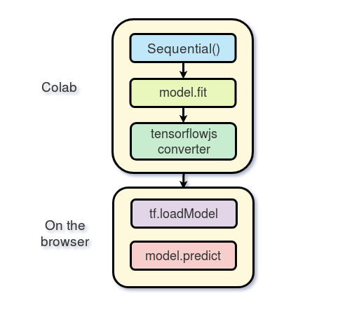

# Machine Learning by Examples

Machine Learning by Examples using Scikit-Learn, Keras, TensorFlow, PyTorch, and OpenCV.

> 1. [Google Colab Notebooks](colab.research.google.com) (Free Nvidia Tesla K80 GPU)
> 2. Sketcher using Keras/TensorFlow and QuickDraw-Dataset
> 3. Disease-Prediction using Machine Learning (Scikit-Learn)
> 4. Recruitment Matching using Machine Learning (Keras & Tesorflow)

## 1.1. Configuring Development Environment using [Google Colab Notebooks](colab.research.google.com)

- [x] Step 1. [Creating Folder on Google Drive](drive.google.com) or choose the default `Colab Notebooks` folder
- [x] Step 2. Opening or Creating a `Colab Notebook
  - [x] Openning 
  - [x] Google Drive: upload [](https://github.com/vbosstech/disease-diagnostic-from-symptoms/archive/master.zip) onto `My Drive/machine-learning`
  - `Google Drive`: `My Drive/machine-learning/disease-diagnostic-from-symptoms/disease_symptoms_data_analysis_DecisionTree.ipynb` > *Open with* > *Colaboratory* 
  - [x] Creating new *Colab Notebook* via *Right click > More > Colaboratory*
- [x] Step 3. Setting Free GPU: 
  - [x] [Google Colab](colab.research.google.com): Edit > Notebook settings: 
    - [x] Runtime type: `Python 3` 
    - [x] Hardware accelerator: `GPU`
- [x] Running or Importing Files with Google Colab
     ```
         from google.colab import drive
         drive.mount("/content/gdrive", force_remount=True)
     ```
     Note: Click the link, copy verification code and paste it to text box; then we can use `/content/gdrive/My Drive/`
- [x] Install Python Module/Package
     ```
         # Install Excel/GoogleSheet Python module
         !pip3 install --upgrade -q gspread
         !pip3 install --upgrade -q xlrd
         
         # Install Keras
         !pip3 install -q keras
         !pip3 install torch torchvision
     ```
- [x] Google Colab Notebooks
     ```
         # RAM & CPU
         !cat /proc/meminfo
         !cat /proc/cpuinfo
         # Restart Google Colab
         !kill -9 -1
     ```
- Note: 12-hour GPU limit is for a continuous assignment of VM.

## 1.2. Usefull Utilities

### 1.2.1. [Facets](https://github.com/PAIR-code/facets) 

### 1.2.2. [Tensorboard](https://github.com/mixuala/colab_utils)
- [x] Upload file using gsutil command to GCS(Google Cloud Storage)
    ```
    # First, we need to set our project. Replace the assignment below
    #with your project ID.
    project_id = 'chatbotdemo-ai'
    !gcloud config set project {project_id}
    import uuid
    # Make a unique bucket to which we'll upload the file.
    # (GCS buckets are part of a single global namespace.)
    bucket_name = 'sample-bucket-' + str(uuid.uuid1())

    # Full reference: https://cloud.google.com/storage/docs/gsutil/commands/mb
    !gsutil mb gs://{bucket_name}
    # Copy the file to our new bucket.
    # Full reference: https://cloud.google.com/storage/docs/gsutil/commands/cp
    !gsutil cp trained_model.pkl gs://{bucket_name}/
    ```
- [x] Upload file from google drive to GCS(Google Cloud Storage)
    ```
        This section demonstrates how to upload files using the native Python API rather than gsutil.
        This snippet is based on a larger example with additional uses of the API
        # The first step is to create a bucket in your cloud project.
        # Replace the assignment below with your cloud project ID.
        # For details on cloud projects, see:
        project_id = 'chatbotdemo-ai'
        # Authenticate to GCS.
        from google.colab import auth
        auth.authenticate_user()

        # Create the service client.
        from googleapiclient.discovery import build
        gcs_service = build('storage', 'v1')

        # Generate a random bucket name to which we'll upload the file.
        import uuid
        bucket_name = 'sample-bucket-' + str(uuid.uuid1())

        body = {
        'name': bucket_name,
        # For a full list of locations, see:
        # https://cloud.google.com/storage/docs/bucket-locations
        'location': 'us',
        }
        gcs_service.buckets().insert(project=project_id, body=body).execute()   
    ```
- [x] Download file using gsutil command on GCS(Google Cloud Storage)
    ```
        # Download the file.
        !gsutil cp gs://{bucket_name}/trained_model.pkl /tmp/trained_model.pkl
        
        # Print the result to make sure the transfer worked.
        !cat /tmp/trained_model.pkl
    ```
- [x] Download file from google drive to GCS(Google Cloud Storage)
    ```
        We repeat the download example above using the native Python API.
        # Authenticate to GCS.
        from google.colab import auth
        auth.authenticate_user()

        # Create the service client.
        from googleapiclient.discovery import build
        gcs_service = build('storage', 'v1')

        from apiclient.http import MediaIoBaseDownload

        with open('/content/gdrive/My Drive/trained_model.pkl', 'wb') as f:
        request = gcs_service.objects().get_media(bucket=bucket_name,
                                                    object='trained_model.pkl')
        media = MediaIoBaseDownload(f, request)

        done = False
        while not done:
            # _ is a placeholder for a progress object that we ignore.
            # (Our file is small, so we skip reporting progress.)
            _, done = media.next_chunk()

    ```

### 1.2.3. [Tensorboard](https://github.com/mixuala/colab_utils)

## 2. Sketcher using Keras/TensorFlow and QuickDraw-Dataset
A simple tool that recognizes drawings and outputs the names of the current drawing. We will use Google Colab for training the model, and we will deploy & run directly on the browser using TensorFlow.js.



### 2.1. Dataset
We will use a CNN to recognize drawings of different types. The CNN will be trained on the [Quick-Draw Dataset](https://github.com/googlecreativelab/quickdraw-dataset).


### 2.2. 

## 2. Disease-Prediction using Machine Learning (Scikit-Learn)


## 3. Recruitment Matching using Machine Learning (Keras & Tesorflow)

### 

## References

- 
- [FastAI](https://github.com/fastai/fastai)