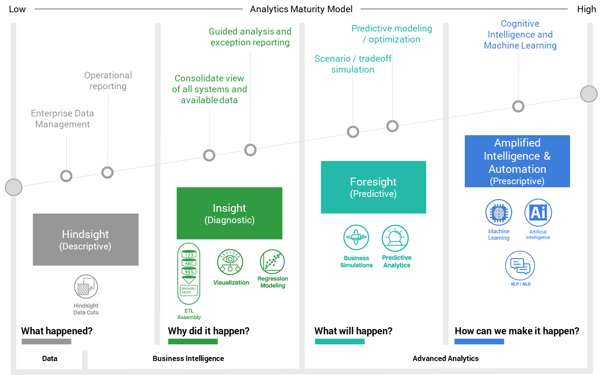

:::tip Why Data Scientist should learn Machine Learning?
:::

## Advanced Analytics maturity model and Machine Learning techniques

<!--  -->

Data scientists evaluate statistical models, create predictive algorithms, test and improve ML model efficiency, use data visualization, garner insights, and communicate the findings to the business stakeholders. So, this is how and why data scientists typically use machine learning from competitive advantage, from `sense &respond` to `predict & act`:

* **Descriptive Analytics** `What happenned?`: 
  * Raw Data -> Cleaned Data -> Standard Reports -> Ad-hoc Reports & OLAP
  * K-Means clustering.
* **Diagnostic Analytics** `Why did it happen?`: 
  * Generic Predictive Analytics
  * Decision Tree.
* **Predictive Analytics** `What will happen?`: 
  * Predictive Modeling
  * regression algorithms, random forests, Support Vector Machine (SVM) algorithms.
* **Prescriptive Analytics** `What should happen` | `What is the best that could happen`: Artificial Intelligence, Machine learning, and neural network algorithms is employed.

